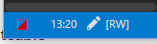

# Read-only Indicator package for Atom

Adds and indicator to the status bar showing if a file is read-only or writeable.

## Screenshots

#### Read-only

#### Writeable

## TODO List

- To be compatible with Mac OS X and Linux
